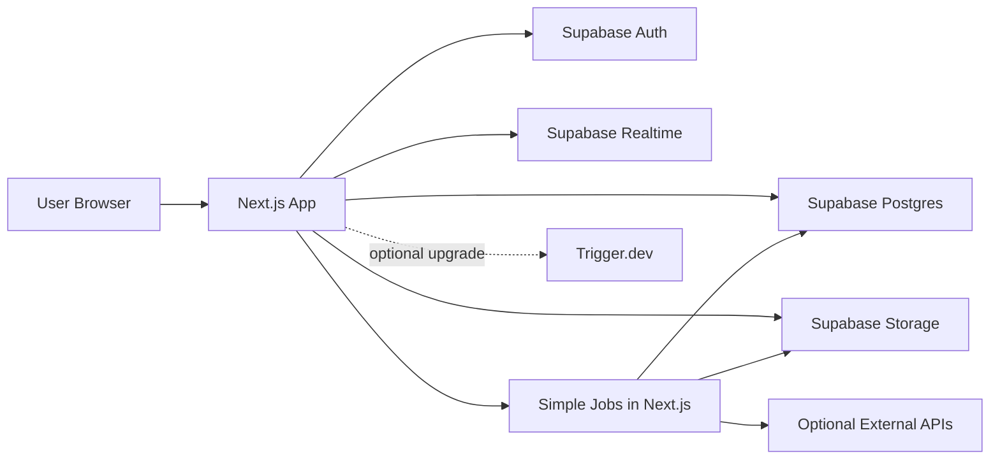

# PRD Sistem Web LMS Modular

Stack utama: Next.js + Drizzle + Supabase  
Versi dokumen: 2.1 - Learning MVP Supabase Free Tier  
Tanggal revisi: 26 Mei 2026  
Bahasa implementasi: Indonesia  
Target pembaca: Junior programmer, UI/UX designer, QA, dan AI coding model biaya rendah

---

## 1. Ringkasan Produk

Sistem ini adalah web LMS untuk pembelajaran berbasis modul, tugas/project, kuis, sertifikat digital, forum diskusi, plagiarism checker, dan monitoring aktivitas. Sistem memiliki 4 role utama:

- `mahasiswa`
- `dosen`
- `admin`
- `super_admin`

Tujuan utama MVP:

1. Mahasiswa login.
2. Mahasiswa melihat kelas, materi, nilai, badge, poin, dan progres modul.
3. Mahasiswa mengerjakan kuis dan mengumpulkan tugas/project.
4. Sistem mengecek progress, nilai, dan plagiarism score.
5. Dosen memverifikasi tugas, melihat analitik, melakukan override plagiarism, dan export laporan.
6. Admin mengelola user, threshold plagiarisme, monitoring, dan laporan global.
7. Super Admin melihat audit log dan mengelola akses tingkat tinggi.
8. Sistem menerbitkan sertifikat digital otomatis jika syarat lulus terpenuhi.

---

## 2. Mode Project: Learning MVP Supabase Free Tier

Project ini dibuat untuk belajar dan demo sampai deployment. Fokus utama adalah fitur berjalan lancar, bukan hardening security tingkat production.

Asumsi Supabase Free Tier:

- Database size sekitar `500 MB`.
- File storage sekitar `1 GB`.
- Bandwidth/egress gratis terbatas, sekitar `5 GB uncached + 5 GB cached`.
- Project gratis bisa pause setelah sekitar 1 minggu tidak aktif.
- Automatic backup production tidak termasuk Free Plan.
- Edge Functions gratis memiliki durasi dan resource terbatas.

Strategi agar tetap aman untuk Free Tier:

- Gunakan data demo secukupnya, bukan ribuan data besar.
- Jangan upload video ke Supabase Storage. Pakai link YouTube unlisted, Google Drive, atau embed.
- Batasi file upload agar storage tidak cepat habis.
- Realtime hanya untuk notifikasi ringan dan forum, bukan seluruh dashboard.
- Background job dibuat sederhana dulu. Trigger.dev boleh dipakai, tetapi tidak wajib untuk demo awal.
- Export laporan dibuat untuk dataset kecil.
- Plagiarism checker dibuat simulasi/local sederhana.
- Security dibuat minimal tetapi tidak boleh membocorkan secret key.

Target demo:

- 4 role bisa login.
- Dashboard tiap role tampil.
- Kelas, modul, materi, tugas, kuis, forum, notifikasi, plagiarism demo, export, dan sertifikat berjalan.
- Project berhasil deploy ke Vercel + Supabase Free.

Non-target untuk Learning MVP:

- Security enterprise.
- Upload video besar.
- Data production kampus asli.
- Load test banyak user.
- Backup dan disaster recovery.
- Provider plagiarism berbayar.
- Integrasi Zoom/WA/Telegram production.

---

## 3. Keputusan Arsitektur

Gunakan stack berikut untuk MVP:

```txt
Next.js 16
TypeScript
Drizzle ORM
Drizzle Kit
Supabase Auth
Supabase Postgres
Supabase Storage
Supabase Realtime
Trigger.dev opsional untuk background jobs
```

Alasan memilih stack ini:

- Satu bahasa utama: TypeScript.
- Next.js dapat menangani frontend, route handler API, server action, dan server component.
- Drizzle membuat schema dan query database lebih dekat ke SQL, sehingga cocok untuk Supabase/Postgres.
- Supabase menyediakan Auth, Postgres, Storage, Realtime, dan Edge Functions.
- Tidak perlu membangun backend Laravel terpisah untuk MVP.
- Lebih mudah dibantu AI coding model murah karena struktur kode dan schema eksplisit.

Keputusan penting:

- Drizzle hanya digunakan di server.
- Supabase client di browser hanya digunakan untuk auth session, upload file sesuai policy, dan realtime subscription.
- Semua business logic penting berjalan di Next.js server atau background job sederhana.
- Jangan pernah expose `service_role`, `DATABASE_URL`, atau secret key ke frontend.
- Role dan authorization tetap dicek di server. RLS boleh dibuat bertahap saat fitur sudah stabil.

---

## 4. Rekomendasi Teknologi

Catatan:

- Jika teknologi memiliki LTS resmi, gunakan latest LTS.
- Jika tidak memiliki LTS resmi, gunakan latest stable dan pin versi di `package.json`.
- Untuk Supabase managed project, gunakan versi Postgres terbaru yang tersedia di dashboard Supabase. Pada Mei 2026, Supabase aktif bergerak ke Postgres 17 untuk platformnya. Jangan memaksa Postgres 18 jika belum tersedia di Supabase project.

| Area | Rekomendasi | Versi yang Disarankan | Catatan |
|---|---:|---:|---|
| Runtime | Node.js | `24.x LTS` | Runtime production dan development. |
| Package manager | pnpm | latest stable | Lebih cepat dan hemat storage. Boleh npm jika tim belum familiar. |
| Framework | Next.js | `16.x Active LTS` | App Router, Server Components, Route Handlers. |
| UI library | React | `19.x` | Ikuti versi yang didukung Next.js 16. |
| Bahasa | TypeScript | `6.x` | Wajib untuk menjaga kontrak data. |
| Database | Supabase Postgres | latest Supabase-supported, target `17.x` | Jangan ubah schema lewat dashboard tanpa migration. |
| ORM | Drizzle ORM | latest stable | Query type-safe yang dekat dengan SQL dan cocok untuk Supabase RLS. |
| Migration/schema tool | Drizzle Kit | latest stable | Generate migration SQL dan Drizzle Studio. |
| Postgres driver | `postgres` / Postgres.js | latest stable | Driver sederhana untuk Drizzle di Next.js server runtime. |
| Auth | Supabase Auth | managed | Email/password untuk MVP, OAuth opsional. |
| Supabase SDK | `@supabase/supabase-js` | `2.x` | Client dan server Supabase operations. |
| Supabase SSR | `@supabase/ssr` | latest stable | Cookie-based auth untuk Next.js SSR. |
| Storage | Supabase Storage | managed | Materi, submission, sertifikat, export. |
| Realtime | Supabase Realtime | managed | Dipakai terbatas untuk notifikasi dan forum ringan. |
| Background jobs | Trigger.dev | optional latest stable | Opsional. Untuk Learning MVP, job boleh dijalankan dari Next.js route/server action selama data kecil. |
| Form validation | Zod | latest stable | Validasi request dan form. |
| Form UI | React Hook Form | latest stable | Form login, kelas, soal, tugas. |
| UI components | shadcn/ui + Radix UI | latest stable | Table, dialog, tabs, dropdown, toast. |
| Icons | lucide-react | latest stable | Ikon tombol dan menu. |
| Styling | Tailwind CSS | `4.x` | Responsive utility-first CSS. |
| Data table | TanStack Table | latest stable | Tabel nilai, audit log, plagiarisme. |
| Client data | TanStack Query | latest stable | Untuk data dinamis yang sering berubah. |
| Chart | Recharts | latest stable | Grafik progress, nilai, analitik soal. |
| Upload besar | Uppy + tus-js-client | optional latest stable | Tidak wajib di awal karena file Learning MVP dibatasi kecil. |
| PDF | `@react-pdf/renderer` | latest stable | Sertifikat dan laporan PDF sederhana. |
| Excel | ExcelJS | latest stable | Export nilai/progress ke `.xlsx`. |
| QR Code | `qrcode` | latest stable | QR verification sertifikat. |
| ZIP handling | JSZip | latest stable | Membaca source code ZIP untuk plagiarism MVP. |
| PDF text extraction | `unpdf` atau `pdf-parse` | latest stable | Ambil teks laporan untuk similarity check. |
| Email | Resend | optional latest stable | Opsional. Learning MVP cukup notifikasi internal. |
| Error monitoring | Sentry | optional latest stable | Opsional. Vercel logs cukup untuk demo awal. |
| Testing unit | Vitest | latest stable | Unit test TypeScript. |
| Testing E2E | Playwright | latest stable | Login, dashboard, kuis, upload. |
| Lint/format | ESLint + Prettier | latest stable | Konsistensi kode. |
| Deployment | Vercel + Supabase | latest stable | Paling mudah untuk Next.js + Supabase. |

Teknologi tambahan yang saya anggap perlu untuk MVP sehat:

- **Trigger.dev**: opsional. Pakai jika export, sertifikat, atau plagiarism check mulai timeout.
- **Uppy + tus-js-client**: opsional. Pakai jika file upload sudah lebih besar dari batas Learning MVP.
- **Sentry**: opsional. Untuk demo awal boleh cukup Vercel logs dan console error.
- **TanStack Table**: penting untuk audit log, nilai, dan laporan plagiarisme.
- **Zod**: wajib agar input API konsisten dan mudah dibaca AI model kecil.
- **Postgres.js**: driver ringan untuk Drizzle. Gunakan Supabase pooler untuk runtime serverless.

---

## 5. Arsitektur Sistem

Diagram sederhana:



Komponen:

- **Next.js App**: UI, protected pages, API routes, server actions.
- **Supabase Auth**: login, logout, reset password, session.
- **Supabase Postgres**: database utama.
- **Drizzle**: ORM server-side untuk query type-safe, schema, dan migration SQL.
- **Supabase Storage**: file materi, submission, certificate PDF, export.
- **Supabase Realtime**: notifikasi dan forum ringan.
- **Simple Jobs in Next.js**: export kecil, generate sertifikat, dan plagiarism demo.
- **Trigger.dev**: opsional jika simple jobs mulai timeout.
- **Supabase Edge Functions**: opsional untuk webhook kecil atau integrasi ringan.

Aturan pemakaian:

- Untuk query data aplikasi kompleks: gunakan Drizzle di server.
- Untuk auth: gunakan Supabase Auth dan `@supabase/ssr`.
- Untuk upload file dari browser: gunakan Supabase Storage dengan batas ukuran kecil.
- Untuk notifikasi realtime: gunakan Supabase Realtime pada tabel `notifications` dan `forum_replies`.
- Untuk job ringan: boleh gunakan Next.js route/server action.
- Untuk job lama atau sering gagal: pindahkan ke Trigger.dev.

---

## 6. Struktur Project

Struktur folder yang disarankan:

```txt
apps/web
|- app
|  |- (auth)
|  |  `- login
|  |- (dashboard)
|  |  |- mahasiswa
|  |  |- dosen
|  |  |- admin
|  |  `- super-admin
|  |- api
|  |  |- classes
|  |  |- assignments
|  |  |- quizzes
|  |  |- plagiarism-checks
|  |  |- certificates
|  |  |- exports
|  |  `- notifications
|  `- verify-certificate
|- components
|- features
|  |- auth
|  |- classes
|  |- assignments
|  |- quizzes
|  |- plagiarism
|  |- certificates
|  |- forum
|  `- notifications
|- lib
|  |- db.ts
|  |- supabase
|  |  |- client.ts
|  |  |- server.ts
|  |  `- proxy.ts
|  |- auth.ts
|  |- permissions.ts
|  |- api-response.ts
|  `- validators
|- jobs
|  |- export-report.ts
|  |- plagiarism-check.ts
|  |- issue-certificate.ts
|  `- quiz-cleanup.ts
|- db
|  |- schema.ts
|  |- relations.ts
|  `- migrations
|- supabase
|  |- migrations
|  `- seed.sql
`- tests
```

Catatan:

- `db/schema.ts` untuk schema Drizzle tabel utama.
- `db/relations.ts` untuk relasi Drizzle.
- `db/migrations/*.sql` untuk migration yang dihasilkan Drizzle Kit.
- `supabase/migrations/*.sql` untuk RLS policy, trigger, storage bucket, extension, dan realtime publication jika lebih mudah dipisah.
- Jangan menulis business logic langsung di komponen UI.

---

## 7. Auth, Role, dan Authorization

### 7.1 Role

Role wajib:

```txt
mahasiswa
dosen
admin
super_admin
```

Tabel `profiles` menyimpan data aplikasi dari user Supabase Auth:

```txt
profiles.id = auth.users.id
profiles.role = mahasiswa | dosen | admin | super_admin
profiles.status = active | inactive
```

Aturan:

- `auth.users` dikelola Supabase Auth.
- `profiles` dikelola aplikasi.
- Jangan menyimpan role di `raw_user_meta_data` untuk authorization.
- Jika perlu menyimpan role di JWT, gunakan `app_metadata`, tetapi tetap validasi ke tabel `profiles` untuk aksi sensitif.

### 7.2 Login

Login memakai Supabase Auth:

- Email/password untuk MVP.
- Reset password memakai Supabase Auth.
- OAuth dapat ditambahkan nanti.

Route:

```txt
/login
/auth/callback
/auth/reset-password
```

Setelah login:

- `mahasiswa` diarahkan ke `/mahasiswa/dashboard`
- `dosen` diarahkan ke `/dosen/dashboard`
- `admin` diarahkan ke `/admin/dashboard`
- `super_admin` diarahkan ke `/super-admin/dashboard`

Acceptance criteria:

- User valid dapat login.
- User invalid melihat error.
- User `inactive` tidak boleh masuk dashboard.
- Server menggunakan `supabase.auth.getUser()` untuk validasi user, bukan hanya membaca session cookie.

### 7.3 Authorization Server-Side

Buat helper:

```txt
requireUser()
requireRole(allowedRoles)
requireActiveProfile()
canAccessClass(userId, classId)
canManageClass(userId, classId)
```

Aturan:

- Semua route handler dan server action wajib memanggil helper auth.
- Drizzle query harus menyertakan filter akses. Contoh: dosen hanya query kelas miliknya.
- Jangan mengandalkan hide/show tombol di frontend sebagai security.

### 7.4 RLS Strategy

Karena Drizzle berjalan di server dengan database connection, RLS tidak selalu menjadi satu-satunya lapisan authorization. Strategi Learning MVP:

- Minimal wajib: cek role dan ownership di Next.js server sebelum query Drizzle.
- Aktifkan RLS bertahap pada tabel yang diakses langsung dari Supabase client, terutama `notifications`, `forum_threads`, `forum_replies`, dan Storage.
- Untuk tabel yang hanya diakses lewat Next.js server, RLS boleh ditunda sampai fitur stabil.
- Definisikan RLS lewat migration SQL atau Drizzle `enableRLS()` dan `pgPolicy` saat mulai hardening.
- Gunakan RLS untuk akses langsung dari Supabase client seperti realtime dan storage-related reads.
- Gunakan server authorization helper untuk semua Drizzle query.
- Untuk tabel sensitif, akses dari browser sebaiknya lewat Next.js server, bukan direct Supabase query.
- Jangan expose schema/tabel yang tidak perlu ke Data API.

---

## 8. Database dan Drizzle Schema

### 8.1 Prinsip Database

- Gunakan UUID untuk primary key.
- Gunakan `created_at`, `updated_at` di semua tabel utama.
- Gunakan soft delete hanya jika diperlukan.
- Gunakan enum konsisten.
- Gunakan snake_case di database.
- Nama tabel dan kolom database wajib snake_case.
- Nama object Drizzle boleh camelCase, tetapi kolom database tetap snake_case.

### 8.2 Tabel MVP

| Tabel | Fungsi |
|---|---|
| `profiles` | Data user aplikasi dan role |
| `classes` | Kelas online |
| `class_members` | Relasi mahasiswa/dosen ke kelas |
| `modules` | Modul dalam kelas |
| `module_steps` | Step/sub-modul |
| `materials` | PDF, video, slide, link |
| `assignments` | Tugas/project |
| `submissions` | Pengumpulan tugas |
| `submission_files` | File laporan/source code |
| `progress_records` | Progress mahasiswa |
| `grades` | Nilai tugas, kuis, final |
| `quizzes` | Data kuis |
| `questions` | Bank soal |
| `question_options` | Pilihan jawaban |
| `quiz_attempts` | Percobaan kuis |
| `quiz_attempt_questions` | Soal acak per attempt |
| `quiz_answers` | Jawaban mahasiswa |
| `exam_mode_events` | Event pelanggaran exam mode |
| `certificates` | Sertifikat digital |
| `certificate_verifications` | Log QR verification |
| `plagiarism_checks` | Hasil cek similarity |
| `plagiarism_matches` | Detail match similarity |
| `plagiarism_overrides` | Riwayat override |
| `forum_threads` | Thread Q&A |
| `forum_replies` | Balasan Q&A |
| `notifications` | Notifikasi internal |
| `badges` | Master badge |
| `student_badges` | Badge mahasiswa |
| `gamification_points` | Riwayat poin |
| `exports` | File export laporan |
| `audit_logs` | Catatan aktivitas penting |
| `system_settings` | Setting global |

### 8.3 Enum Wajib

Gunakan enum ini persis:

```txt
user_status: active, inactive
class_status: draft, published, archived
member_role: student, lecturer, assistant
material_type: pdf, video, slide, link
progress_status: not_started, in_progress, submitted, verified, failed, locked
submission_status: draft, submitted, under_review, accepted, rejected, locked, resubmit_allowed
plagiarism_status: pending, passed, flagged, rejected_permanent, resubmit_allowed
quiz_attempt_status: started, submitted, reset, expired
certificate_status: draft, issued, revoked
notification_status: unread, read
forum_thread_status: open, answered, closed
export_status: pending, processing, completed, failed
```

### 8.4 Drizzle Schema Inti

Contoh ringkas model inti. Detail field dapat dikembangkan saat implementasi.

```ts
import {
  jsonb,
  pgEnum,
  pgTable,
  text,
  timestamp,
  uuid,
} from "drizzle-orm/pg-core";

export const userRole = pgEnum("user_role", [
  "mahasiswa",
  "dosen",
  "admin",
  "super_admin",
]);

export const userStatus = pgEnum("user_status", ["active", "inactive"]);
export const classStatus = pgEnum("class_status", ["draft", "published", "archived"]);

export const profiles = pgTable("profiles", {
  id: uuid("id").primaryKey(),
  name: text("name").notNull(),
  email: text("email").notNull().unique(),
  role: userRole("role").notNull(),
  status: userStatus("status").notNull().default("active"),
  avatarUrl: text("avatar_url"),
  lastLoginAt: timestamp("last_login_at", { withTimezone: true }),
  createdAt: timestamp("created_at", { withTimezone: true }).notNull().defaultNow(),
  updatedAt: timestamp("updated_at", { withTimezone: true }).notNull().defaultNow(),
});

export const classes = pgTable("classes", {
  id: uuid("id").primaryKey().defaultRandom(),
  lecturerId: uuid("lecturer_id").notNull(),
  title: text("title").notNull(),
  description: text("description"),
  status: classStatus("status").notNull().default("draft"),
  createdAt: timestamp("created_at", { withTimezone: true }).notNull().defaultNow(),
  updatedAt: timestamp("updated_at", { withTimezone: true }).notNull().defaultNow(),
});

export const auditLogs = pgTable("audit_logs", {
  id: uuid("id").primaryKey().defaultRandom(),
  actorId: uuid("actor_id"),
  actorRole: text("actor_role"),
  action: text("action").notNull(),
  entityType: text("entity_type"),
  entityId: uuid("entity_id"),
  metadata: jsonb("metadata"),
  ipAddress: text("ip_address"),
  userAgent: text("user_agent"),
  createdAt: timestamp("created_at", { withTimezone: true }).notNull().defaultNow(),
});
```

Catatan:

- `profiles.id` harus sama dengan `auth.users.id`.
- Tabel Supabase internal seperti `auth.users` dan `storage.objects` jangan dimodelkan penuh di Drizzle kecuali sangat perlu.
- RLS policy dapat dibuat lewat SQL migration atau Drizzle `pgPolicy`.
- Relasi lengkap ditambahkan saat implementasi.

---

## 9. Supabase Storage

### 9.1 Bucket

Bucket Learning MVP:

| Bucket | Akses | Isi |
|---|---|---|
| `avatars` | private/public terbatas | Foto profil |
| `materials` | private | PDF, slide, dan link video |
| `submissions` | private | Laporan dan source code mahasiswa |
| `certificates` | private + public verify page | PDF sertifikat |
| `exports` | private | Excel/PDF laporan |

### 9.2 Upload

Aturan upload Learning MVP:

- Gunakan upload biasa dari Supabase SDK terlebih dahulu.
- Hindari file besar agar tidak cepat menghabiskan storage gratis.
- File lebih dari 10 MB sebaiknya ditolak dulu di MVP belajar.
- Uppy + tus-js-client hanya dipakai jika nanti perlu resumable upload.
- Video tidak diupload ke Supabase Storage. Simpan sebagai URL/link.
- Path file harus mengandung scope akses. Contoh:

```txt
materials/{class_id}/{module_id}/{file_name}
submissions/{class_id}/{assignment_id}/{student_id}/{file_name}
certificates/{class_id}/{student_id}/{certificate_number}.pdf
exports/{user_id}/{export_id}.xlsx
```

### 9.3 File Limit Learning MVP

| Jenis | Ekstensi | Max Size |
|---|---|---:|
| PDF laporan | `.pdf` | 5 MB |
| Slide | `.pdf`, `.ppt`, `.pptx` | 10 MB |
| Source code | `.zip` | 10 MB |
| Gambar | `.jpg`, `.jpeg`, `.png`, `.webp` | 2 MB |
| Video materi MVP | link eksternal | tidak upload |

Catatan:

- Untuk MVP, video disarankan berupa link YouTube unlisted, Google Drive, atau platform kampus.
- Upload video langsung ke Storage boleh menjadi fase lanjut.
- Agar aman di Free Tier, target total file demo di Storage sebaiknya kurang dari 300 MB.

---

## 10. Background Jobs

Untuk Learning MVP, job boleh dibuat sederhana agar mudah deploy.

Urutan implementasi:

1. Jalankan job ringan dari Next.js route handler/server action.
2. Simpan status job di database.
3. Jika job mulai timeout atau sering gagal, baru pindahkan ke Trigger.dev.

Job MVP:

| Job | Trigger | Implementasi Learning MVP | Output |
|---|---|---|---|
| `run-plagiarism-check` | submission dibuat | Next.js server route | plagiarism score dan status |
| `generate-export` | dosen/admin klik export | Next.js server route | file Excel/PDF |
| `issue-certificate` | progress/nilai berubah | Next.js server route | certificate PDF dan QR |
| `send-notification` | event sistem | insert database biasa | notifikasi internal |
| `cleanup-expired-quiz-attempts` | manual/admin atau cron opsional | Next.js route/admin button | attempt expired/reset |
| `recalculate-progress` | verifikasi tugas/override | function server biasa | progress terbaru |

Aturan:

- Job penting tetap sebaiknya idempotent.
- Job harus menyimpan status ke database jika hasilnya perlu ditampilkan ke user.
- User mendapat notifikasi jika job selesai atau gagal.
- Trigger.dev tidak wajib untuk demo awal.

---

## 11. API dan Response Standard

Gunakan Next.js Route Handlers untuk API.

Prefix:

```txt
/api
```

Response sukses:

```json
{
  "success": true,
  "message": "Data berhasil diambil",
  "data": {}
}
```

Response error:

```json
{
  "success": false,
  "message": "Validasi gagal",
  "errors": {
    "email": ["Email wajib diisi"]
  }
}
```

HTTP status:

- `200` sukses GET/PATCH.
- `201` sukses create.
- `400` request salah.
- `401` belum login.
- `403` tidak punya akses.
- `404` data tidak ditemukan.
- `422` validasi gagal.
- `500` server error.

Aturan API:

- Validasi input dengan Zod.
- Gunakan helper `successResponse()` dan `errorResponse()`.
- Semua API private wajib cek user aktif.
- Semua aksi sensitif wajib membuat audit log.

---

## 12. Modul 1 - UI/UX Designer & Frontend Developer

### 12.1 Tujuan Modul

Membuat tampilan dan interaksi awal yang mudah dipakai untuk semua role.

### 12.2 Halaman Login

Requirement:

- Form login berisi `email` dan `password`.
- Tombol `Masuk`.
- Link `Lupa Password`.
- Error validasi dekat field.
- Setelah login, redirect sesuai role.

Acceptance criteria:

- User valid dapat login.
- User invalid melihat error.
- User inactive tidak bisa masuk.
- Session tersimpan memakai Supabase SSR cookie flow.
- Logout menghapus session.

### 12.3 Dashboard Mahasiswa

Komponen wajib:

- Ringkasan progres total dalam persen.
- Daftar kelas yang diikuti.
- Nilai rata-rata.
- Badge pencapaian.
- Poin gamifikasi.
- Modul aktif.
- Status tugas terakhir.
- Notifikasi terbaru.
- Shortcut ke forum.

Data minimal:

```txt
total_progress_percent
average_score
badges_count
gamification_points
active_modules
latest_notifications
```

Acceptance criteria:

- Dashboard responsive di mobile, tablet, desktop.
- Modul terkunci tidak bisa dibuka.
- Progress konsisten dengan backend.
- Notifikasi realtime muncul jika ada update.

### 12.4 Dashboard Dosen

Komponen wajib:

- Statistik jumlah kelas.
- Statistik jumlah mahasiswa.
- Rata-rata nilai per kelas.
- Analitik soal tersulit.
- Tabel tugas menunggu verifikasi.
- Tombol export Excel.
- Tombol export PDF.
- Panel laporan plagiarisme.
- Tombol override plagiarisme.

Acceptance criteria:

- Dosen hanya melihat kelas yang dikelola.
- Export berjalan sebagai background job.
- Override hanya muncul untuk laporan flagged.

### 12.5 Dashboard Admin

Komponen wajib:

- Statistik user aktif.
- Monitoring aktivitas.
- Laporan plagiarisme global.
- Pengaturan threshold plagiarisme.
- Manajemen user dasar.
- Notifikasi sistem.

Acceptance criteria:

- Admin dapat mengubah threshold plagiarisme.
- Admin bisa melihat laporan plagiarisme global.
- Admin tidak bisa menghapus audit log.

### 12.6 Dashboard Super Admin

Komponen wajib:

- Semua fitur admin.
- Audit log global.
- Filter audit log berdasarkan user, role, tanggal, dan aksi.
- Monitoring aktivitas sensitif.
- Pengaturan role dan permission.

Acceptance criteria:

- Super Admin bisa melihat audit log.
- Audit log tidak bisa diedit dari UI.
- Perubahan role tercatat ke audit log.

### 12.7 Forum Diskusi/Q&A

Requirement:

- User dapat membuat thread di kelas yang diikuti/dikelola.
- User dapat membalas thread.
- Dosen/Admin dapat menandai jawaban sebagai `accepted`.
- Thread memiliki status `open`, `answered`, atau `closed`.
- User menerima notifikasi saat thread dibalas.
- Update reply dapat memakai Supabase Realtime.

Acceptance criteria:

- Mahasiswa tidak bisa masuk forum kelas lain.
- Dosen bisa moderasi thread kelasnya.
- Admin bisa melihat semua forum.

### 12.8 Notifikasi Internal

Requirement:

- Notifikasi muncul di navbar.
- Notifikasi memiliki status `unread` atau `read`.
- Notifikasi realtime memakai Supabase Realtime pada tabel `notifications`.
- Jenis notifikasi MVP:
  - tugas diverifikasi
  - tugas ditolak
  - plagiarisme flagged
  - kuis selesai dinilai
  - sertifikat terbit
  - export selesai
  - forum dibalas

Acceptance criteria:

- Badge unread tampil benar.
- User bisa menandai read.
- Notifikasi tidak bocor ke user lain.

---

## 13. Modul 2 - Core LMS & Modul Pembelajaran

### 13.1 Tujuan Modul

Membangun manajemen kelas, modul, materi, tugas, progress, nilai, dan export.

### 13.2 Endpoint Core

Classes:

```txt
GET    /api/classes
POST   /api/classes
GET    /api/classes/{class_id}
PATCH  /api/classes/{class_id}
DELETE /api/classes/{class_id}
```

Modules dan steps:

```txt
POST   /api/classes/{class_id}/modules
PATCH  /api/modules/{module_id}
DELETE /api/modules/{module_id}
POST   /api/modules/{module_id}/steps
PATCH  /api/steps/{step_id}
DELETE /api/steps/{step_id}
```

Materials:

```txt
POST   /api/steps/{step_id}/materials
DELETE /api/materials/{material_id}
POST   /api/materials/{material_id}/signed-url
```

Assignments:

```txt
POST  /api/assignments
GET   /api/assignments/{assignment_id}
POST  /api/assignments/{assignment_id}/submissions
GET   /api/submissions/{submission_id}
POST  /api/submissions/{submission_id}/verify
POST  /api/submissions/{submission_id}/allow-resubmit
```

Acceptance criteria:

- Dosen tidak bisa mengedit kelas dosen lain.
- Materi tidak dapat diakses mahasiswa yang tidak terdaftar.
- Upload file dibatasi ukuran dan tipe file.
- Submission memicu job `run-plagiarism-check`.
- Verifikasi dosen mengubah progress.

### 13.3 Alur Tugas

Alur:

1. Dosen membuat assignment.
2. Mahasiswa upload laporan dan source code.
3. Submission status menjadi `submitted`.
4. Job plagiarism berjalan.
5. Jika passed, dosen dapat verifikasi.
6. Jika flagged, submission locked.
7. Dosen/Admin melakukan override jika perlu.
8. Progress berubah berdasarkan hasil verifikasi/override.

Status:

```txt
draft -> submitted -> under_review -> accepted
draft -> submitted -> under_review -> rejected
submitted -> locked jika plagiarism flagged
locked -> resubmit_allowed jika override allow resubmit
locked -> rejected_permanent jika override reject permanen
```

### 13.4 Export Excel/PDF

Endpoint:

```txt
POST /api/classes/{class_id}/exports/excel
POST /api/classes/{class_id}/exports/pdf
GET  /api/exports/{export_id}/download
```

Requirement:

- Export Learning MVP dibuat langsung dari Next.js route/server action untuk data kecil.
- Trigger.dev dipakai nanti jika export mulai timeout.
- Excel dibuat memakai ExcelJS.
- PDF laporan dibuat memakai `@react-pdf/renderer`.
- File disimpan di bucket `exports`.
- User mendapat notifikasi saat selesai.
- Batasi export demo, misalnya maksimal 100 mahasiswa per kelas.

Acceptance criteria:

- Dosen hanya export kelas yang dikelola.
- Admin dapat export laporan global.
- Download memakai signed URL.

---

## 14. Modul 3 - Kuis & Exam Mode

### 14.1 Tujuan Modul

Membangun bank soal, kuis acak, koreksi otomatis, nilai instan, reset state, dan exam mode.

### 14.2 Bank Soal

Requirement:

- Dosen dapat input soal pilihan ganda.
- Setiap soal punya:
  - pertanyaan
  - pilihan A/B/C/D
  - jawaban benar
  - bobot nilai
  - tingkat kesulitan: `easy`, `medium`, `hard`
- Bank soal dapat difilter berdasarkan kelas, modul, dan tingkat kesulitan.

Endpoint:

```txt
GET    /api/questions
POST   /api/questions
PATCH  /api/questions/{question_id}
DELETE /api/questions/{question_id}
```

Acceptance criteria:

- Soal tidak bisa dipakai kuis jika belum punya jawaban benar.
- Dosen hanya mengelola soal kelasnya.

### 14.3 Pengacakan Soal

Endpoint:

```txt
POST /api/quizzes/{quiz_id}/start
GET  /api/quiz-attempts/{attempt_id}
POST /api/quiz-attempts/{attempt_id}/answers
POST /api/quiz-attempts/{attempt_id}/submit
```

Requirement:

- Saat klik `Mulai Kuis`, server membuat `quiz_attempt`.
- Server mengambil soal secara acak.
- Soal acak disimpan di `quiz_attempt_questions`.
- Attempt aktif hanya satu per mahasiswa per kuis.
- Timer dihitung di backend memakai `started_at` dan `expires_at`.

Acceptance criteria:

- Refresh halaman tidak mengubah soal jika attempt masih valid.
- Attempt expired tidak bisa disubmit.
- Submit menghitung nilai otomatis.

### 14.4 Koreksi Otomatis

Rumus MVP:

```txt
score = (total_bobot_jawaban_benar / total_bobot_soal) * 100
```

Acceptance criteria:

- Nilai 0 sampai 100.
- Nilai tersimpan di `grades`.
- Statistik soal tersulit dihitung dari persentase jawaban salah.

### 14.5 Reset State

Requirement:

- Jika mahasiswa keluar/refresh kuis di tengah jalan, sistem dapat menandai attempt sebagai `reset`.
- Event yang dicatat:
  - browser refresh
  - tab close
  - route change keluar halaman exam
  - visibility hidden lebih dari 10 detik
  - keluar fullscreen
- Setelah reset:
  - attempt lama menjadi `reset`
  - jawaban lama tidak dipakai
  - masuk ulang membuat attempt baru

Catatan:

- Browser tidak bisa 100% menjamin semua event terkirim.
- Backend timer tetap menjadi sumber kebenaran.

### 14.6 Exam Mode

Requirement frontend:

- Meminta full screen sebelum mulai.
- Memblokir copy.
- Memblokir paste.
- Memblokir context menu.
- Memberi warning jika keluar full screen.
- Memberi warning jika pindah tab.

Requirement backend:

- Menyimpan `exam_mode_events`.
- Jika pelanggaran melebihi batas, attempt bisa `reset` atau `expired`.
- Batas pelanggaran MVP: 3 warning.

Acceptance criteria:

- Mahasiswa tidak bisa mulai exam sebelum full screen.
- Copy-paste dicegah di halaman exam.
- Warning tercatat.
- Audit log mencatat reset/expired.

---

## 15. Modul 4 - Sertifikat Digital & Integrasi Sistem

### 15.1 Syarat Sertifikat Otomatis

Sertifikat diterbitkan jika:

```txt
progress_total = 100
final_score >= 70
plagiarism_status tidak rejected_permanent
```

Requirement:

- Job `issue-certificate` berjalan saat progress/nilai berubah.
- Sertifikat hanya satu kali per mahasiswa per kelas.
- Sertifikat dapat `revoked` oleh admin/super admin.

### 15.2 Sertifikat PDF

Requirement:

- PDF dibuat memakai `@react-pdf/renderer`.
- QR dibuat memakai package `qrcode`.
- File disimpan di bucket `certificates`.
- QR mengarah ke halaman publik:

```txt
https://domain.com/verify-certificate/{qr_token}
```

Isi sertifikat:

- Nama mahasiswa.
- Nama kelas.
- Progress modul.
- Nilai akhir.
- Tanggal terbit.
- Nomor sertifikat.
- QR code.

Acceptance criteria:

- PDF dapat diunduh.
- QR dapat dipindai.
- Data dalam PDF sama dengan data certificate.

### 15.3 QR Verification

Halaman publik:

```txt
/verify-certificate/{qr_token}
```

Menampilkan:

- status sertifikat
- nama mahasiswa
- nama kelas
- nomor sertifikat
- tanggal terbit
- nilai akhir

Acceptance criteria:

- Sertifikat valid tampil sebagai valid.
- Sertifikat revoked tampil sebagai revoked.
- Token salah menampilkan not found.
- Setiap pengecekan masuk `certificate_verifications`.

### 15.4 Integrasi Pihak Ketiga

MVP:

- Buat interface/adapter saja, belum wajib integrasi real.

Adapter:

```txt
VideoMeetingProvider
AcademicSystemProvider
OutboundNotificationProvider
BlockchainAnchorProvider
SimilarityProvider
```

Fase lanjut:

- Zoom/Google Meet/MS Teams API.
- SIAKAD Kampus/LMS Nasional.
- Email/WA/Telegram API.
- Blockchain anchor untuk hash sertifikat.
- Provider similarity berbayar.

---

## 16. Modul 5 - Plagiarism Checker & Locking Modul

### 16.1 Tujuan Modul

Mendeteksi similarity tugas, mengunci modul jika flagged, dan menyediakan override untuk dosen/admin.

### 16.2 Threshold

Aturan default:

```txt
similarity_score < 70  -> passed
similarity_score >= 70 -> flagged
```

Threshold disimpan di `system_settings` dan dapat diubah admin.

### 16.3 Strategi Similarity Learning MVP

Gunakan pendekatan bertahap:

1. Buat service `PlagiarismService`.
2. Untuk demo awal, simpan `submission_text` saat mahasiswa upload tugas atau isi ringkasan laporan.
3. Jika file PDF kecil tersedia, ekstrak teks dari PDF laporan.
4. Untuk source code ZIP kecil, baca file teks/code saja dan abaikan file binary.
5. Jika ekstraksi gagal, gunakan dummy score yang dapat diatur admin untuk kebutuhan demo.
6. Normalisasi teks:
   - lowercase
   - hapus whitespace berlebih
   - hapus stopword dasar
   - tokenisasi
7. Hitung similarity dengan Jaccard/Cosine similarity sederhana.
8. Bandingkan dengan submission lain di kelas dan assignment yang sama.
9. Simpan hasil ke `plagiarism_checks` dan `plagiarism_matches`.

Catatan:

- Local checker MVP bukan pengganti Turnitin.
- Targetnya adalah menunjukkan alur fitur, bukan akurasi plagiarism checker production.
- Hasil flagged perlu override karena false positive mungkin terjadi.
- Provider external seperti Copyleaks/JPlag dapat ditambahkan lewat `SimilarityProvider`.

### 16.4 Locking Otomatis

Jika plagiarism status `flagged`:

- submission menjadi `locked`
- progress modul menjadi `locked`
- mahasiswa tidak bisa edit/upload ulang
- mahasiswa tidak bisa lanjut ke modul berikutnya
- mahasiswa mendapat notifikasi
- dosen mendapat notifikasi

Acceptance criteria:

- Modul berikutnya terkunci.
- Tombol upload ulang hilang.
- Lock reason tampil di dashboard mahasiswa.

### 16.5 Override

Tombol wajib:

- `Reject Permanen`
- `Izinkan Ulang Upload`

Aturan `Reject Permanen`:

- Nilai modul menjadi 0.
- Submission tetap locked.
- Plagiarism status menjadi `rejected_permanent`.
- Modul berikutnya terbuka agar mahasiswa bisa lanjut.
- Audit log wajib dibuat.

Aturan `Izinkan Ulang Upload`:

- Submission menjadi `resubmit_allowed`.
- Progress kembali `in_progress`.
- Mahasiswa bisa upload ulang.
- Audit log wajib dibuat.

Endpoint:

```txt
GET   /api/plagiarism-checks
GET   /api/plagiarism-checks/{check_id}
POST  /api/plagiarism-checks/{check_id}/reject-permanent
POST  /api/plagiarism-checks/{check_id}/allow-resubmit
PATCH /api/admin/settings/plagiarism-threshold
```

Acceptance criteria:

- Override hanya bisa dilakukan dosen pemilik kelas, admin, atau super admin.
- Reason wajib diisi.
- Riwayat override tampil di panel.

---

## 17. Audit Log

Aktivitas wajib masuk audit log:

- Login gagal berulang.
- User dibuat/diubah/dinonaktifkan.
- Role user berubah.
- Kelas dibuat/diubah/dihapus.
- Materi diupload/dihapus.
- Tugas diverifikasi.
- Progress berubah manual.
- Quiz attempt reset/expired.
- Plagiarism flagged.
- Plagiarism override.
- Threshold plagiarisme berubah.
- Sertifikat issued/revoked.
- Export laporan dibuat/download.
- Super Admin membuka audit log.

Aturan:

- Audit log tidak boleh diedit.
- Audit log tidak boleh dihapus dari UI.
- Super Admin dapat filter dan export audit log.
- Query audit log wajib pagination.

---

## 18. Aturan Progress

Progress dihitung dari modul wajib.

Contoh:

```txt
Jika kelas memiliki 5 modul wajib:
1 modul verified = 20%
2 modul verified = 40%
5 modul verified = 100%
```

Aturan:

- Modul status `verified` dihitung selesai.
- Modul status `failed` tidak dihitung selesai.
- Modul status `locked` tidak bisa dikerjakan.
- Jika dosen menerima tugas, progress modul menjadi `verified`.
- Jika plagiarism `rejected_permanent`, nilai modul 0 tetapi modul berikutnya boleh terbuka.

Acceptance criteria:

- Progress tidak bisa lebih dari 100.
- Progress tidak bisa kurang dari 0.
- Perubahan progress manual tercatat di audit log.

---

## 19. Aturan Nilai

Jenis nilai:

- Nilai tugas.
- Nilai kuis.
- Nilai akhir.

Rumus MVP:

```txt
final_score = (average_assignment_score * 0.6) + (average_quiz_score * 0.4)
```

Aturan:

- KKM default: `70`.
- KKM disimpan di `system_settings`.
- Dosen bisa melihat nilai kelasnya.
- Mahasiswa hanya melihat nilainya sendiri.

Acceptance criteria:

- Nilai akhir konsisten di dashboard, export, dan sertifikat.
- Jika nilai berubah, job `issue-certificate` dijalankan ulang.

---

## 20. Gamifikasi

MVP:

- Poin saat modul selesai: `+10`.
- Poin saat kuis lulus: `+10`.
- Poin saat semua modul selesai: `+50`.
- Badge `Starter`: menyelesaikan modul pertama.
- Badge `Consistent`: menyelesaikan 3 modul.
- Badge `Finisher`: progress 100%.

Acceptance criteria:

- Poin tidak dobel untuk event yang sama.
- Badge tidak dobel.
- Mahasiswa melihat badge dan poin di dashboard.

---

## 21. UI/UX Guidelines

Prinsip:

- Dashboard padat, rapi, dan mudah discan.
- Jangan membuat landing page sebagai halaman utama setelah login.
- Mobile first.
- Gunakan table untuk data operasional.
- Gunakan card hanya untuk ringkasan atau item berulang.
- Gunakan chart untuk statistik nilai/progress.
- Gunakan warna status konsisten:
  - success: hijau
  - warning: kuning/oranye
  - danger: merah
  - info: biru
  - neutral: abu-abu

Komponen wajib:

- Navbar/topbar.
- Sidebar desktop.
- Bottom navigation atau drawer untuk mobile.
- Data table dengan search/filter.
- Modal konfirmasi untuk aksi berbahaya.
- Toast untuk feedback singkat.
- Empty state.
- Loading state.
- Error state.

Accessibility:

- Semua button punya label jelas.
- Contrast text terbaca.
- Form error muncul dekat field.
- Jangan hanya mengandalkan warna untuk status.

---

## 22. Security Requirements Learning MVP

Security tidak menjadi fokus utama, tetapi pagar dasar ini tetap wajib agar project aman saat online.

Wajib untuk Learning MVP:

- Password dikelola Supabase Auth.
- Semua private route wajib auth.
- Validasi role dilakukan server-side.
- File upload dibatasi tipe dan ukuran.
- File source code tidak dieksekusi server.
- Jangan expose `service_role`, `DATABASE_URL`, atau secret key.
- Jangan gunakan `user_metadata` untuk authorization.
- Submission mahasiswa sebaiknya disimpan di bucket private.
- Audit log cukup untuk aksi utama: login, verifikasi tugas, override plagiarism, sertifikat, dan perubahan role.

Boleh ditunda sampai fase hardening:

- RLS lengkap untuk semua tabel.
- Rate limit custom.
- CORS detail.
- Security headers lengkap.
- MFA.
- Backup strategy.
- Penetration testing.

Catatan:

- Jika tabel dibaca langsung dari Supabase client/browser, aktifkan RLS pada tabel tersebut.
- Jika semua akses tabel lewat Next.js server + Drizzle, pengecekan role server-side sudah cukup untuk demo belajar.
- `service_role` hanya boleh dipakai di server dan hanya jika benar-benar diperlukan.

Environment variable:

```txt
NEXT_PUBLIC_SUPABASE_URL
NEXT_PUBLIC_SUPABASE_PUBLISHABLE_KEY
SUPABASE_SERVICE_ROLE_KEY
DATABASE_URL
DATABASE_MIGRATION_URL
TRIGGER_SECRET_KEY
RESEND_API_KEY
SENTRY_DSN
```

Aturan:

- Hanya variable dengan prefix `NEXT_PUBLIC_` yang boleh dipakai browser.
- `SUPABASE_SERVICE_ROLE_KEY`, `DATABASE_URL`, dan `DATABASE_MIGRATION_URL` hanya server.
- `TRIGGER_SECRET_KEY`, `RESEND_API_KEY`, dan `SENTRY_DSN` opsional untuk Learning MVP.

---

## 23. Performance Requirements

Target Learning MVP:

- Login response kurang dari 1 detik.
- Dashboard response kurang dari 3 detik untuk data demo.
- Export boleh berjalan sync selama dataset kecil.
- Plagiarism check boleh berjalan sync/asynchronous sederhana selama file kecil.
- Upload besar tidak menjadi target Learning MVP.
- Pagination wajib untuk table lebih dari 20 data.
- Query dashboard memakai index.
- Batasi seed demo, misalnya maksimal 50-100 mahasiswa, 5 kelas, 10 modul per kelas.

Index minimal:

- `profiles.email`
- `profiles.role`
- `class_members.profile_id`
- `class_members.class_id`
- `modules.class_id`
- `submissions.student_id`
- `submissions.assignment_id`
- `progress_records.student_id`
- `progress_records.class_id`
- `audit_logs.created_at`
- `audit_logs.actor_id`
- `notifications.user_id`
- `plagiarism_checks.status`
- `quiz_attempts.student_id`
- `certificates.qr_token`

---

## 24. Testing Requirements

Backend/server test:

- Login sukses dan gagal.
- Redirect role benar.
- Dosen tidak bisa akses kelas dosen lain.
- Mahasiswa tidak bisa akses kelas lain.
- Upload submission.
- Verifikasi submission mengubah progress.
- Kuis start menghasilkan soal acak.
- Submit kuis menghitung nilai.
- Plagiarism flagged mengunci modul.
- Override membuka upload ulang.
- Sertifikat terbit jika progress 100 dan nilai >= 70.

Frontend test:

- Login redirect sesuai role.
- Dashboard mahasiswa render mobile.
- Dashboard dosen render table dan chart.
- Upload tugas menampilkan progress.
- Exam mode meminta full screen.
- Notifikasi dapat ditandai read.

QA manual:

- Cek responsif 360px, 768px, 1440px.
- Cek empty state.
- Cek error state.
- Cek upload file terlalu besar.
- Cek akses role salah.
- Cek audit log setelah aksi penting.
- Cek QR sertifikat.

---

## 25. Deployment

Rekomendasi Learning MVP Supabase Free Tier:

```txt
Frontend/API: Vercel
Database/Auth/Storage/Realtime: Supabase Cloud
Background Jobs: Next.js route/server action sederhana
Email: tidak wajib
Monitoring: Vercel logs
Optional upgrade: Trigger.dev, Resend, Sentry
```

Local development:

```txt
pnpm install
supabase start
pnpm db:generate
pnpm db:migrate
pnpm dev
```

Package scripts yang disarankan:

```json
{
  "db:generate": "drizzle-kit generate",
  "db:migrate": "drizzle-kit migrate",
  "db:studio": "drizzle-kit studio",
  "db:push": "drizzle-kit push"
}
```

Production deploy:

1. Deploy Drizzle migrations.
2. Deploy Supabase-specific migrations untuk storage bucket dan RLS minimal jika dipakai.
3. Deploy Next.js ke Vercel.
4. Set environment variables.
5. Jalankan smoke test.
6. Klik beberapa fitur utama agar project Supabase tidak idle saat masa pengembangan.

Catatan:

- Jangan jalankan job berat di Vercel route handler biasa. Untuk demo kecil masih boleh.
- Gunakan direct database URL untuk migration.
- Gunakan Supabase connection pooler untuk runtime serverless jika traffic meningkat.
- Gunakan `db:push` hanya untuk prototyping/local. Untuk production, gunakan migration.
- Free project dapat pause setelah tidak aktif. Jika project pause, restore dari dashboard Supabase sebelum demo.

---

## 26. Milestone Implementasi

### Milestone 1 - Foundation

- Setup Next.js 16.
- Setup Supabase project.
- Setup Drizzle ORM dan Drizzle Kit.
- Setup Auth SSR.
- Setup profiles dan role.
- Setup layout dashboard.
- Setup audit log helper.

Output:

- User bisa login/logout.
- Redirect role berjalan.
- Dashboard placeholder tampil.

### Milestone 2 - Core LMS

- CRUD kelas.
- CRUD modul/step.
- Upload materi ke Supabase Storage.
- Enrollment mahasiswa.
- Dashboard mahasiswa dan dosen memakai data real.

Output:

- Dosen bisa membuat kelas.
- Mahasiswa bisa melihat kelas.

### Milestone 3 - Assignment & Progress

- Assignment.
- Submission upload.
- Verification.
- Progress calculation.
- Notification realtime.

Output:

- Tugas dapat dikumpulkan dan diverifikasi.
- Progress berubah otomatis.

### Milestone 4 - Quiz & Exam Mode

- Bank soal.
- Start quiz acak.
- Submit quiz.
- Auto grading.
- Exam mode dasar.

Output:

- Mahasiswa bisa mengerjakan kuis.
- Nilai muncul otomatis.

### Milestone 5 - Plagiarism & Locking

- Local similarity checker sederhana.
- Dummy/manual similarity score untuk kebutuhan demo jika ekstraksi file belum stabil.
- Threshold setting.
- Locking modul.
- Override dosen/admin.
- History tracking.

Output:

- Submission flagged terkunci.
- Dosen/admin bisa override.

### Milestone 6 - Certificate & Export

- Certificate rule.
- PDF certificate.
- QR verification.
- Export Excel/PDF.

Output:

- Sertifikat terbit otomatis.
- Dosen bisa export laporan.

### Milestone 7 - Admin & Super Admin Completion

- Audit log UI.
- Monitoring aktivitas.
- User management.
- Permission management.
- Smoke test deployment.
- Security hardening ringan: pastikan secret tidak bocor dan route private butuh login.

Output:

- Admin/Super Admin dapat mengelola sistem.

---

## 27. Definition of Done

Fitur dianggap selesai jika:

- UI selesai dan responsif.
- Server action/API selesai.
- Validasi input dengan Zod.
- Role access server-side selesai.
- Error handling selesai.
- Loading dan empty state ada.
- Audit log ada jika aksi sensitif.
- Minimal test ada.
- Tidak ada data bocor antar role.
- Dokumentasi endpoint singkat tersedia.

---

## 28. Risiko dan Mitigasi

| Risiko | Dampak | Mitigasi |
|---|---|---|
| Database Free Tier mencapai 500 MB | Database bisa read-only | Batasi seed demo, bersihkan audit log dummy, jangan simpan teks/file besar di database |
| Storage Free Tier mencapai 1 GB | Upload gagal atau demo terganggu | File upload kecil, video hanya link, target total storage demo kurang dari 300 MB |
| Egress Free Tier habis | Aplikasi lambat/terbatas | Jangan preview file besar berulang, cache asset, gunakan file demo kecil |
| Project Free pause karena tidak aktif | Demo tidak bisa dibuka langsung | Restore project dari Supabase dashboard sebelum demo |
| Drizzle bypass RLS jika memakai privileged connection | Data bocor jika server auth lemah | Semua Drizzle query wajib lewat helper authorization |
| Service key bocor ke frontend | Data dapat diakses penuh | Jangan pakai secret pada `NEXT_PUBLIC_` |
| Exam Mode tidak bisa 100% cegah kecurangan | Ekspektasi berlebihan | Jelaskan sebagai pencegahan dasar |
| Plagiarism false positive | Mahasiswa dirugikan | Override dan history wajib |
| Upload besar gagal | UX buruk | Tolak file besar di Learning MVP |
| Export/plagiarism timeout | Job gagal | Batasi dataset kecil, pindahkan ke Trigger.dev jika perlu |
| Realtime tidak muncul karena RLS/publikasi salah | Notifikasi tidak realtime | Gunakan polling/manual refresh sebagai fallback |
| Integrasi pihak ketiga lambat | MVP tertunda | Buat adapter dummy dulu |
| Sertifikat dipalsukan | Reputasi turun | QR verification dan token unik |

---

## 29. Open Questions

Pertanyaan untuk stakeholder:

- Apakah user dibuat manual oleh admin atau import CSV?
- Apakah satu mahasiswa bisa ikut banyak kelas?
- Apakah satu kelas bisa punya lebih dari satu dosen?
- Apakah KKM selalu 70 atau per kelas?
- Apakah bobot tugas/kuis dapat diubah dosen?
- Apakah source code wajib ZIP?
- Provider plagiarism production apa?
- Apakah video materi cukup link eksternal di MVP?
- Domain publik untuk QR sertifikat apa?
- Apakah export audit log hanya untuk super admin?
- Apakah sistem perlu multi-kampus sejak awal?

---

## 30. Catatan untuk AI Coding Model Biaya Rendah

Gunakan prompt task kecil seperti ini:

```txt
Konteks:
Saya membangun LMS dengan Next.js 16, Drizzle, Supabase Auth, Supabase Postgres, Supabase Storage.

Tugas:
Buat fitur [nama fitur].

Role yang boleh akses:
[role]

Tabel Drizzle yang dipakai:
[nama tabel]

Route/API:
[method + path]

Aturan bisnis:
[aturan singkat]

Acceptance criteria:
[daftar cek]

Batasan:
Jangan ubah fitur lain.
Jangan buat enum baru.
Gunakan Zod untuk validasi.
Gunakan helper requireUser dan requireRole.
Gunakan response API standar PRD.
Jangan panggil Drizzle dari client component.
```

Contoh task:

```txt
Buat POST /api/classes untuk role dosen.
Input: title, description.
Aturan: lecturer_id diambil dari user login. Status default draft.
Validasi: title wajib, minimal 3 karakter.
Audit: buat audit_logs action class.created.
Test: dosen sukses create, mahasiswa gagal 403.
```

---

## 31. Referensi Resmi

Versi dan fitur diverifikasi pada 26 Mei 2026. Gunakan patch terbaru pada saat instalasi.

- Node.js release schedule: https://github.com/nodejs/release
- Next.js support policy: https://nextjs.org/support-policy
- Next.js 16 upgrade guide: https://nextjs.org/docs/app/guides/upgrading/version-16
- Supabase pricing: https://supabase.com/pricing
- Supabase database size docs: https://supabase.com/docs/guides/platform/database-size
- Supabase storage bandwidth/egress docs: https://supabase.com/docs/guides/storage/serving/bandwidth
- Supabase Edge Functions limits: https://supabase.com/docs/guides/functions/limits
- Supabase Next.js guide: https://supabase.com/docs/guides/getting-started/tutorials/with-nextjs
- Supabase Auth docs: https://supabase.com/docs/guides/auth
- Supabase Realtime Postgres Changes: https://supabase.com/docs/guides/realtime/postgres-changes
- Supabase Storage resumable uploads: https://supabase.com/docs/guides/storage/uploads/resumable-uploads
- Supabase Drizzle guide: https://supabase.com/docs/guides/database/drizzle
- Drizzle RLS docs: https://orm.drizzle.team/docs/rls
- Drizzle with Supabase tutorial: https://orm.drizzle.team/docs/tutorials/drizzle-with-supabase
- Trigger.dev docs: https://trigger.dev/docs
- Tailwind CSS: https://tailwindcss.com
